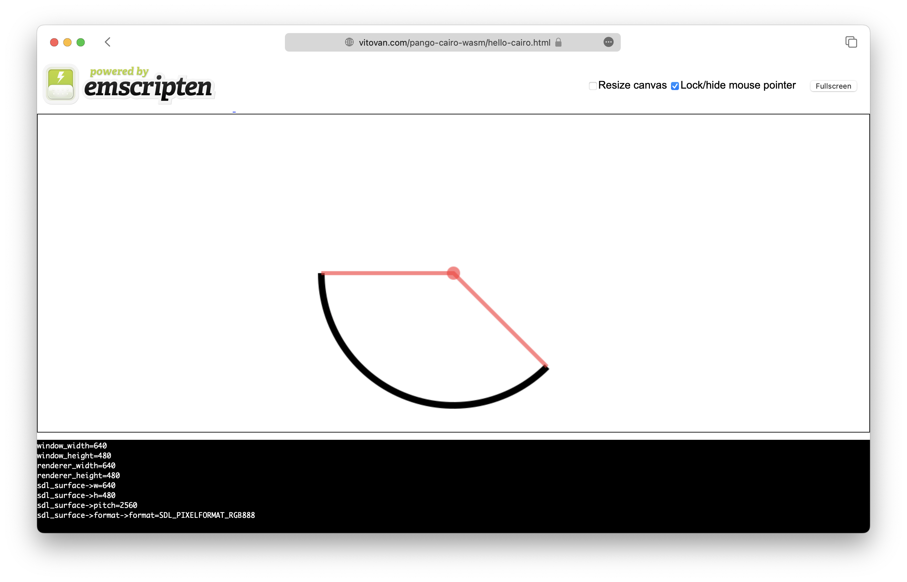
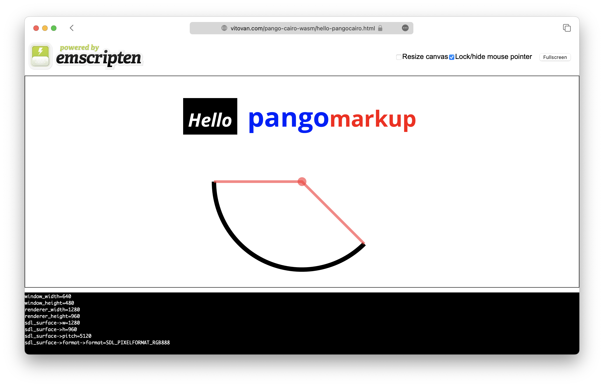

# PangoCairo on the Web

[](https://github.com/VitoVan/pango-cairo-wasm/actions/workflows/docker.yml) [](<https://hub.docker.com/r/vitovan/pango-cairo-wasm>) [](https://github.com/VitoVan/pango-cairo-wasm/actions/workflows/gh-pages.yml)

Compile [Cairo](https://www.cairographics.org/) / [Pango](https://docs.gtk.org/Pango/index.html) / [PangoCairo](https://docs.gtk.org/PangoCairo) based applications from C to WebAssembly?

Try it online (1.5 ~ 3.5 MB data transfer):

> If the links failed you, please [clone](https://github.com/VitoVan/pango-cairo-wasm/tree/gh-pages) and serve them locally with [wasm-server](https://github.com/VitoVan/pango-cairo-wasm/blob/main/wasm-server).

**Cairo**: https://vitovan.com/pango-cairo-wasm/hello-cairo.html

**PangoCairo**: https://vitovan.com/pango-cairo-wasm/hello-pangocairo.html

Preview:






## Usage

### Setup emcc & pkg-config

#### with Docker

```bash
alias emcc="docker run --rm --name pcwa -v $(pwd):/app -w=/app vitovan/pango-cairo-wasm emcc"
alias pkg-config="docker run --rm --name pcwa -v $(pwd):/app -w=/app vitovan/pango-cairo-wasm pkg-config"
# give it a try
emcc --help
pkg-config --libs --cflags pangocairo
```

#### from Source

This build.sh only compiles on Fedora, if you can't get one, please modify it before execution.

```bash
git clone https://github.com/VitoVan/pango-cairo-wasm.git
cd pango-cairo-wasm
git submodule init
git submodule update
echo -e "export magicdir=${HOME}/pango-cairo-wasm-magic\n$(cat env.sh)" > env.sh
bash build.sh
```

Wait for 20 minutes or more. If all went well, execute:

```bash
. env.sh
# give it a try
emcc --help
pkg-config --libs --cflags pangocairo
```

### Compile C Code

#### Cairo with no pthread

```bash
export CAIRO_FLAGS="$(pkg-config --libs --cflags glib-2.0, gobject-2.0, cairo, pixman-1, freetype2, fontconfig, cairo, expat, harfbuzz) -s USE_SDL=2 -s USE_PTHREADS=0 -s ASYNCIFY"

curl -LO https://raw.githubusercontent.com/VitoVan/pango-cairo-wasm/main/hello-cairo.c
emcc $CAIRO_FLAGS hello-cairo.c -o hello-cairo.html
```

#### PangoCairo with pthread

```bash
export PANGOCAIRO_FLAGS="$(pkg-config --libs --cflags glib-2.0, gobject-2.0, cairo, pixman-1, freetype2, fontconfig, cairo, expat, harfbuzz, pangocairo) -s USE_SDL=2 -s EMULATE_FUNCTION_POINTER_CASTS -s PTHREAD_POOL_SIZE=10 -s USE_PTHREADS=1 -s ASYNCIFY"
curl -LO https://raw.githubusercontent.com/VitoVan/pango-cairo-wasm/main/hello-pangocairo.c
# get yourself the fonts
mkdir ./fonts
cd fonts
curl -LO https://raw.githubusercontent.com/VitoVan/pango-cairo-wasm/main/fonts/OpenSans-VariableFont_wdth,wght.ttf
curl -LO https://raw.githubusercontent.com/VitoVan/pango-cairo-wasm/main/fonts/OpenSans-Italic-VariableFont_wdth,wght.ttf
cd ..
# compile
emcc $PANGOCAIRO_FLAGS --embed-file ./fonts@/usr/share/fonts/ hello-pangocairo.c -o hello-pangocairo.html
```

#### Start the debug server

```bash
curl -LO https://raw.githubusercontent.com/VitoVan/pango-cairo-wasm/main/wasm-server
chmod +x wasm-server
./wasm-server
```

open the following links in your browser:

- http://localhost:4242/hello-cairo.html
- http://localhost:4242/hello-pangocairo.html
